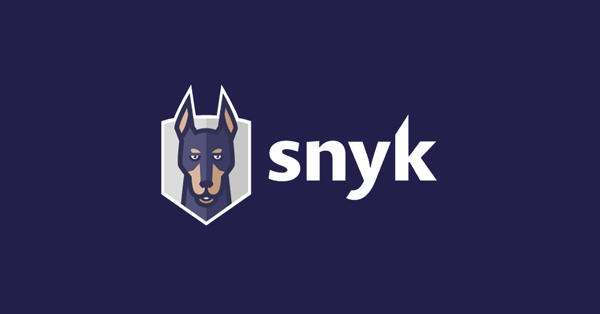
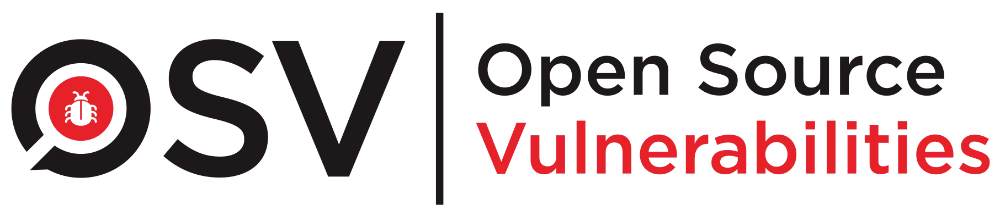
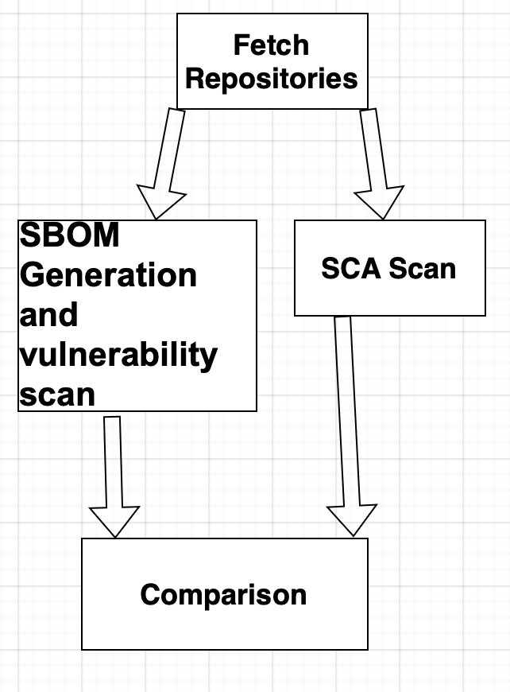
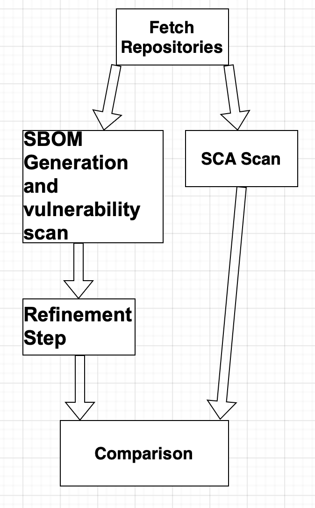

# Software Supply Chain Security

Software supply chain security has become a critical concern due to the widespread use of open-source third-party dependencies in modern software systems.  

**Software Bill of Materials (SBOM)** and **Software Composition Analysis (SCA)** tools are widely adopted to:  
- Improve dependency transparency  
- Detect known vulnerabilities  

However, the effectiveness of SBOM-based approaches as standalone mechanisms for vulnerability assessment remains unclear.

---

## Research Questions

- **Is an SBOM-based approach a reliable proxy for vulnerability assessment compared to traditional SCA tools?**  
- **Does a hybrid approach combining SBOM and SCA improve vulnerability coverage?**

---

## Methodology

To answer these questions, we conducted an experimental study on popular open-source repositories.

**Languages/Platforms:**  
- *Java (Maven)*  
- *Python*

**Tools used:**  
- *Trivy*  
- *Snyk*  
- *OSV-Scanner*  

  
  
  

---

## Assessment Pipelines

- **SBOM-based** and **SCA-based** (Workflow A)  

  

- **SBOM-refined vulnerability assessment** (Workflow B)  

  

All the code is located in the **Workflows** folder, including test scripts for compiling code and an extension for Semgrep.  
All runs were conducted using **GitHub Actions**.

**Note:**  
Workflow files were renamed to align filenames with the corresponding `name` fields in the YAML configuration for improved clarity and maintainability. The internal **`name:`** fields remain unchanged, so historical runs are still identifiable under their original workflow file names in **GitHub Actions**.
